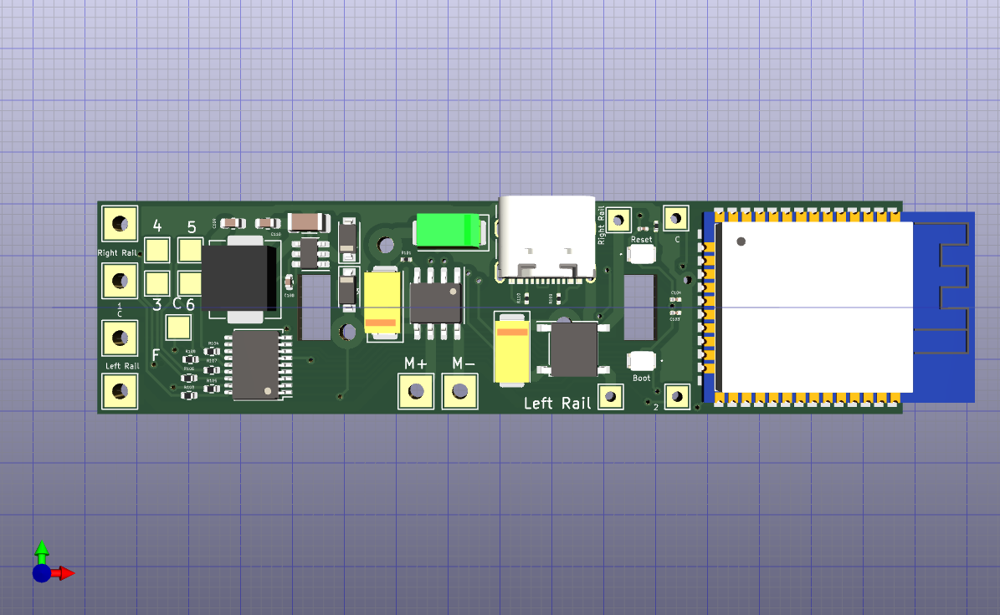

# Atlas Light Board WiFi LCC Traction Node

This is a WiFi LCC Traction Node that is a drop in replacement for any HO 
diesel loco that has mounting for a DCC decoder like the NCE DA-SR or TCS A4X,
that is the Atlas Light Board DCC decoders.

It has support for 6 function outputs.

